# Beth-project

## Introduction 
The BETH dataset addresses a critical need in cybersecurity research: the availability of real-world, labeled data for anomaly detection. Unlike synthetic datasets, BETH captures genuine host activity and attacks, making it a valuable resource for developing robust machine learning models [1].

 The scale, diversity, and structured heterogeneity of BETH dataset makes it an invaluable resource for advancing anomaly detection techniques and enhancing the robustness of machine learning models in the cybersecurity domain.

**Size and Composition of the dataset:**
- BETH comprises over eight million data points collected from 23 hosts.
- Each host records both benign activity (normal behavior) and, at most, one attack.
- The dataset is diverse, reflecting various types of network traffic and system events.
  
**Structured Heterogeneity of the dataset:**
- BETH’s features are highly structured but heterogeneous.
- This diversity mirrors the complexity of real-world cybersecurity data.
- Features include network traffic statistics, system logs, and process-level information.
  
**Scale and realism of the BETH dataset:**
- BETH is one of the largest publicly available cybersecurity datasets.
- It captures contemporary host behavior, including modern attacks.
- Researchers can use BETH to study the impact of scale on anomaly detection algorithms.

**Behavioral Diversity:**
- The dataset covers a wide range of activities, from routine tasks to malicious actions.
- Hosts exhibit different patterns, making BETH suitable for behavioral analysis.

**Robustness Benchmarking:**
- BETH enables evaluating the robustness of machine learning models.
- Researchers can assess how well their algorithms generalize to unseen attacks.
- It serves as a benchmark for novel anomaly detection techniques.

## Data analysis
The Beth datset represents more than 8 milions events collected over 23 honeypots, only nearly 1 milion of it will be used on this project.
Data are already divided into training, valadating and testing dataset (60% / 20% /20%).

### Features
Each of this dataset has those features:
 - timestamp: time in seconds since system  boot (float)

 - processId: id of the process spawning this log (integer)
 

 - threadId: id of the thread (integer)
 there is a total of 545 thread ids.
 

 - parentProcessId: parent process id (integer)
 

 - userId: login integer id (integer)
 

 - mountNamespace: Set mounting restrictions this process log (integer)
 

 - processName: command executed (string)

 - hostName: host server (string)
 

 - eventId: id of the event generating this log (integer)

 - eventName: name of the event (string)
 

 

 - stackAddresses: memory values relevant to the process (list of integer)
 
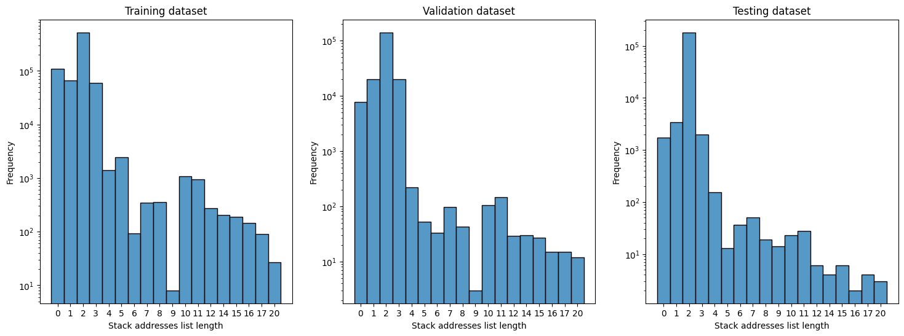

 
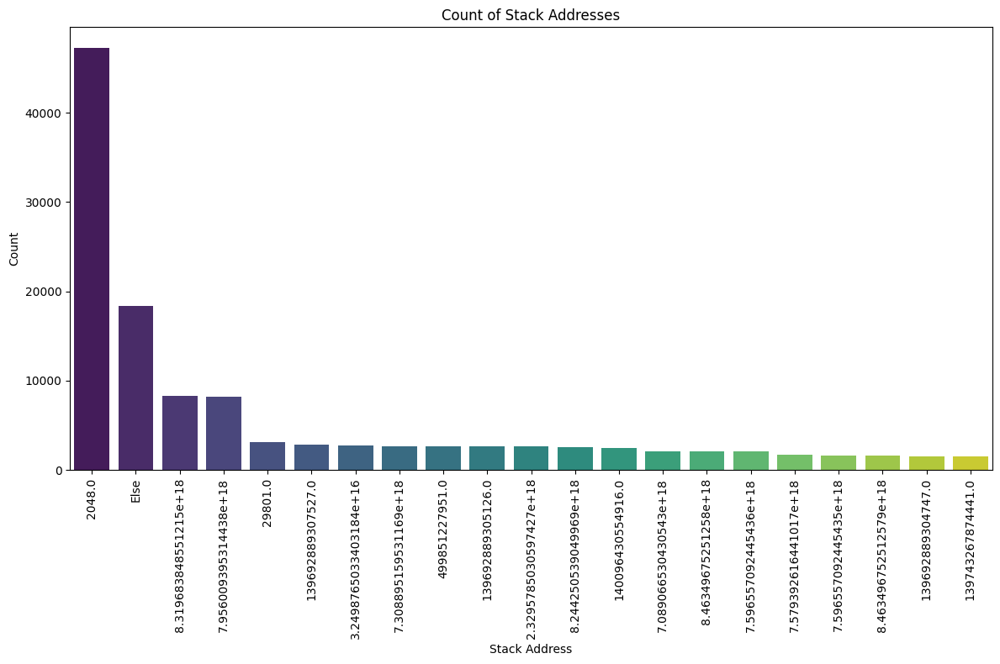

 - returnValue: value returned from this event log (integer)
 
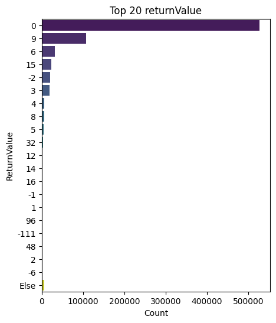

 - argsNum: number of arguments (integer)
 
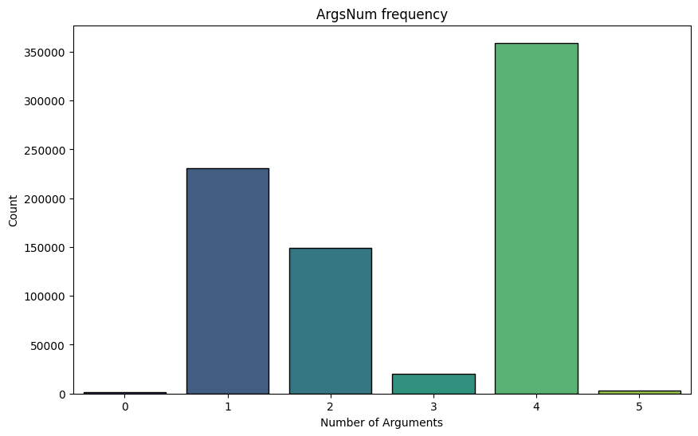

 - args: arguments passed to this process (list of dictionaries)

 - sus: This is an integer label where 0 indicates non-suspicious activity and 1 indicates suspicious activity.
 We want to develop a model that can accurately classify and identify suspicious activities based on this labeling system.
 
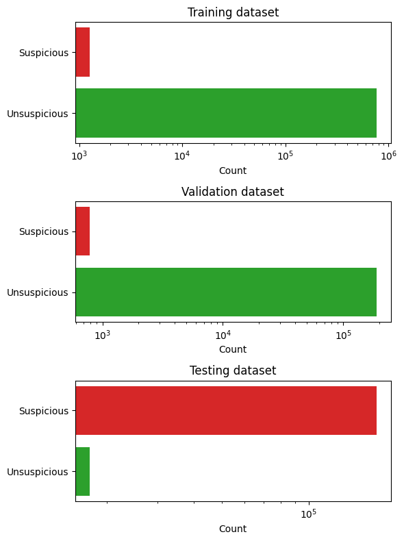

 - evil: This is an integer label where 0 indicates non-malicious activity and 1 indicates malicious activity.
 This label was not chosen for classification because the training and validation datasets do not contain any malicious classes.
 
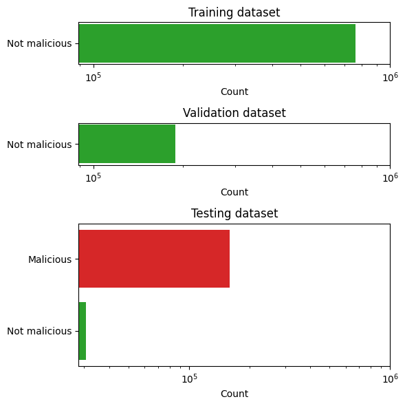

### Correlation matrix

 - Strong Positive Correlations:
    - processId and threadId: They have a correlation of 1.00, indicating they are perfectly correlated. This makes sense as threadId is often associated with processId.
    - parentProcessId and userId: With a correlation of 0.55, it suggests a moderate positive relationship. Likely because parent processes are tied to user accounts.
    - sus and userId: This has a high correlation of 0.77, suggesting that suspicious activity (sus) is strongly linked with specific user IDs.
    - evil and userId: This shows a very strong positive correlation of 0.90, indicating that 'evil' actions are highly associated with certain user IDs.
    - sus and evil: With a correlation of 0.73, it indicates that actions labeled as suspicious are strongly correlated with those labeled as evil.

 - Moderate Positive Correlations:
    - timestamp and userId: A correlation of 0.68 suggests that timestamps are moderately positively related to user IDs, possibly indicating certain users are more active at certain times.
    - parentProcessId and timestamp: With 0.67, it shows a moderate positive relationship.
    - sus and parentProcessId: This correlation is 0.69, indicating that suspicious activities are moderately correlated with parent processes.
    - evil and parentProcessId: Correlation of 0.72, indicating a strong association between evil actions and parent processes.

 - Negative Correlations:
    - mountNamespace with processId, threadId, parentProcessId: These are moderately negatively correlated (around -0.26), indicating that certain process/thread IDs and their parent processes are less likely to have specific mountNamespace values.
    - eventId with timestamp, userId, sus, evil: Negative correlations, especially -0.36 with timestamp and -0.39 with userId, suggest that certain events are less likely to happen at certain times or for certain users.
    - eventId with sus and evil: Both are negatively correlated (around -0.35 to -0.38), indicating that particular events are less associated with suspicious and evil activities.

 - Low/No Correlation:
    - argsNum and other variables: Mostly low correlations, suggesting that the number of arguments has little to no linear relationship with the other features.
    - returnValue and other variables: Low correlations overall, indicating the return value of processes is largely independent of other features.

 - Interpreting Specific Pairs:
    - timestamp and sus/evil: These have correlations of 0.62 and 0.70, respectively. This suggests that the timing of events is significantly associated with suspicious and evil activities.
    - mountNamespace: Shows mostly weak correlations with other features, suggesting that mountNamespace values are relatively independent of other variables.

### Event Frequency 
The following chart shows the entire frequency of suspicius and not suspicius event:

 - Event Frequency: The y-axis represents the frequency of events, ranging from 0 to over 7000.

 - Timestamp: The x-axis represents the timestamps when the events occurred.

 - Not Suspicious Events: Represented by blue lines. The frequency of these events is higher and more variable, with several spikes reaching high values, particularly towards the left side of the chart.

 - Suspicious Events: Represented by red lines. These events are less frequent and usually have lower values compared to the "Not Suspicious" events. There are a few noticeable spikes in the red lines, indicating higher frequencies of suspicious events at certain timestamps.

Overall, the chart shows that "Not Suspicious" events occur more frequently and with higher peaks compared to "Suspicious" events, which occur less often and with lower peaks.

## Data preparation
### Numerical data transformation
As adviced by the authors of the beth dataset's paper, we applied these transformation:
 - ProcessId and ParentprocessId: 0 if it is [0,1,2] otherwise 1
 - UserId: 0 if id is less than 1000 otherwise 1
 - MountNameSpace: 0 if it is equal to 4026531840 otherwise 1
 - ReturnValue: 0 if it is 0, 1 if it is positif and 2 if it is negatif

### StackAddresses
Stackaddresses sf a list of numerics with a maximum of 20 elements.
We created 20 new columns named "stack_1", "stack_2", etc. in each dataset, and assigns each element from the list to its respective new column.

### Args
Args column contains a list of maximum 5 dictionaries, each disctionary contains three elements ({'name': 'dev', 'type': 'dev_t', 'value': 211812353}).
We created 15 new columns in each datset, and assigns each element from the dictionaries to its respective new column.

### Ordinal encoding
Ordinal encoding is a technique for converting categorical data, where variables have distinct labels or categories, into numerical form suitable for machine learning algorithms. It assigns a unique integer value to each category based on its order or rank.
As our approch is for an unsupervised model, we used ordinal encoder to handle new classes not present in the training dataset.
### Scaling
Numerical features are scaled to similar range as they have different scales.
Since we used ordinal encoding for categorical features, scaling is not necessary. Ordinal encoding preserves the order of the categories, but the assigned values don't necessarily reflect their magnitude.
### Smote
Dealing with unbalanced data can be tricky, most of the machine learning model will give good results for big classes and poor performance on the minority althought, as it is our case, minority class is more important.
To balance that, we tried to use Smote library combined as it is adviced with randoom undersampling for the majority class.
SMOTE (Synthetic Minority Oversampling TEchnique) works by interpolating new instances along line segments joining existing minority class instances.
### Shapelet discovery method
Shapelet discovery is a technique used in time series analysis to identify discriminative subpatterns, known as shapelets, within a set of time series data. Shapelets are subsequences that capture characteristic patterns or behaviors in the data.
The process of shapelet discovery involves searching through the time series data to find subsequences that are representative of different classes or categories like in our case for **suspicious activities and not suspicious activities**. 
The similarity or distance between each subsequence and the rest of the data is computed to determine its discriminative power. The shapelets with the highest discriminative power are selected as representative patterns.

So the shapelet discovery can use the matrix profile as a tool for efficiently computing the distances or similarities between subsequences. By utilizing the matrix profile, shapelet discovery algorithms can reduce the computational complexity and speed up the process of identifying shapelets.

The following chart describe how the comparison with the suspicious activity differs to the comparison with the not suspicious activity.

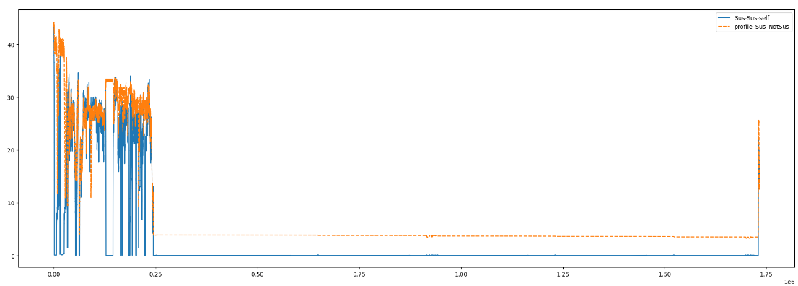

## Models
### Dense neural network

#### Model 1:
This model is composed with five hidden dense layers each with 512 units and ReLU activation, interspersed with dropout layers for regularization, and an output layer with a single unit and sigmoid activation for binary classification.
Each dense layer uses the 'lecun_normal' initializer for the kernel and a RandomNormal initializer for the bias
 - **Structure**:
 
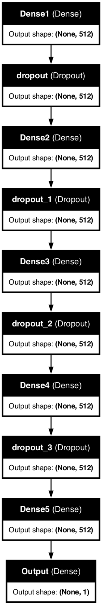

 - **Training**:
 
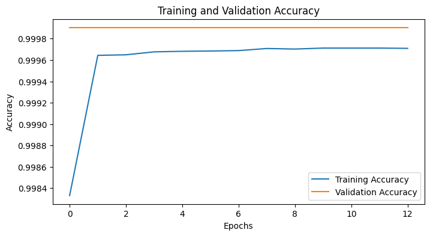

#### Model 2:
 - **Structure**:
 
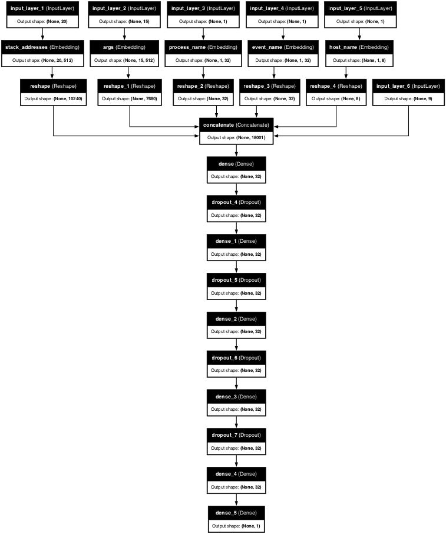

 - **Training**
 
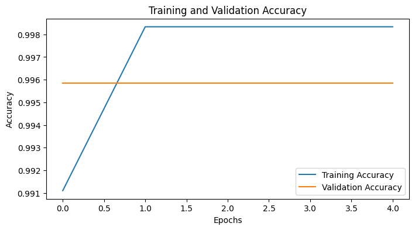

#### Model 3:
 - **Structure**:
 

 - **Training**
 
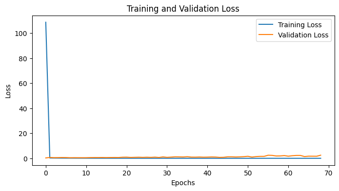

#### Model 4: Dense model with the Shapelet Discovery method
 - **Structure**:
 
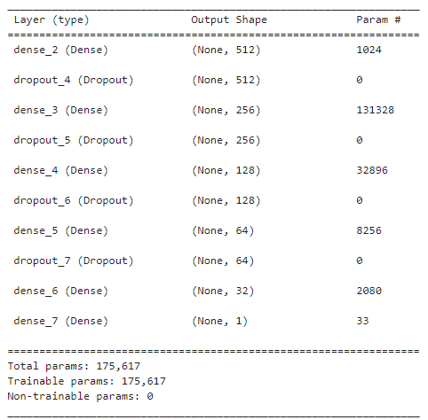

 - **Training**
 
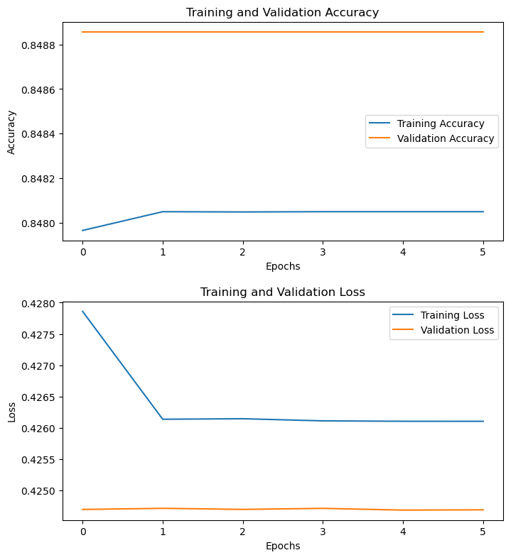

 - **Confusion Matrix**
  
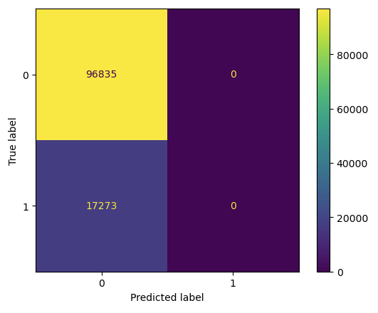
 
   
### Convolutional neural network
#### Model 1
 - **Structure**
 
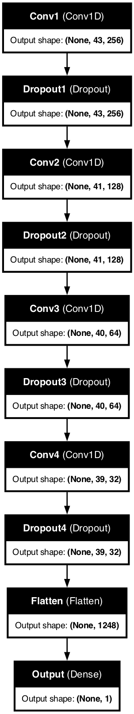

 - **Training**
 
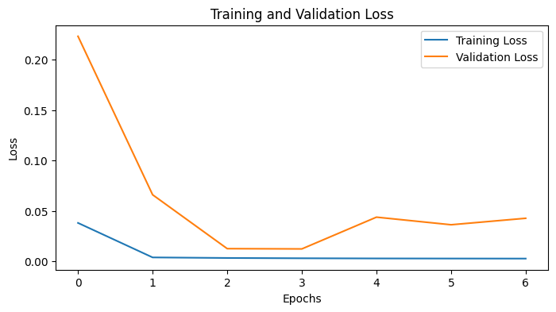

#### Model 2
 - **Structure**
 
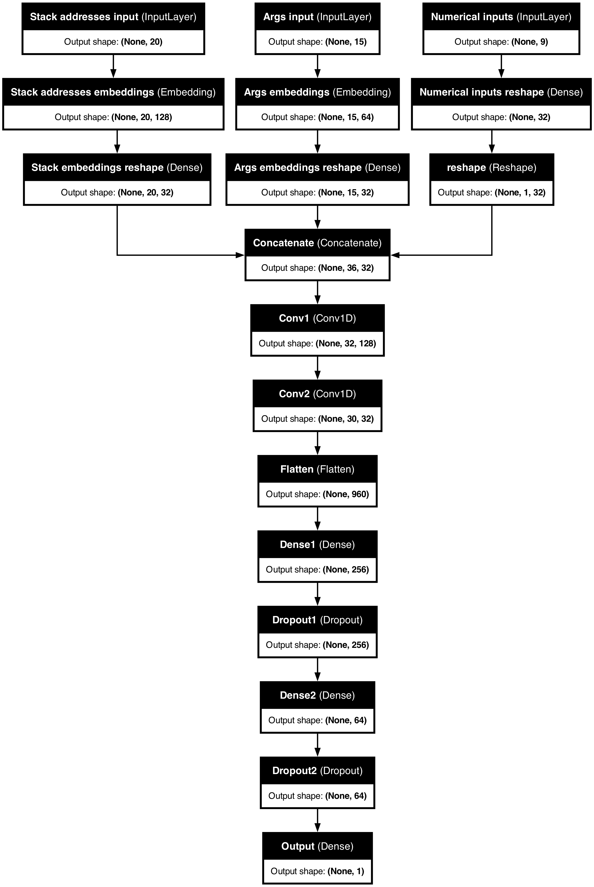

 - **Training**
 
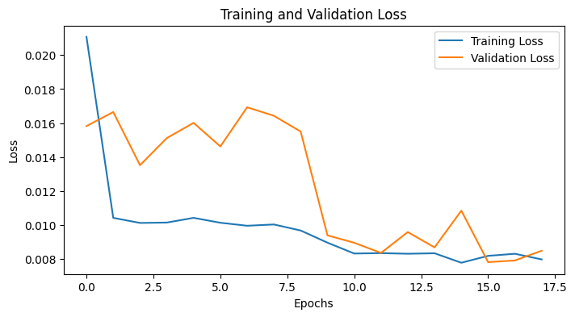

### LSTM neural network
#### Model 1 (no embeddings)
#### Model 2 (with embeddings)
#### Model 3 (shapelet discovery method)
- **Structure**

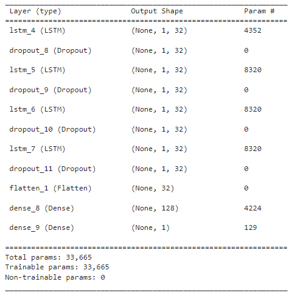

  
- **Training**

  
- **Confusion Matrix**

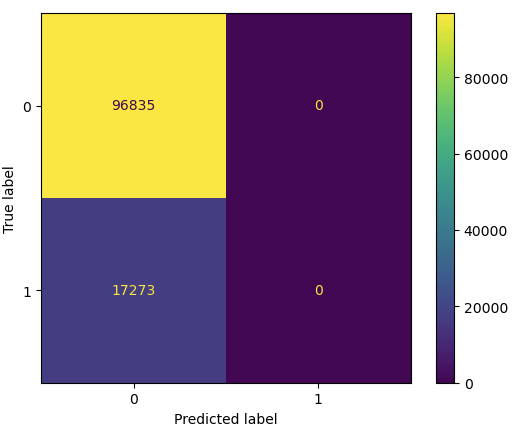

### Transformer
#### Positional encoding:
The positional encoding gives information about the position of elements within a sequence to the input embeddings. This technique is crucial in the Transformer architecture, as it enables the model to understand the order of the sequence, which is otherwise lost in the absence of recurrence or convolution.
In our model, we used sinusoidal positional encoding.
 - **Training**:

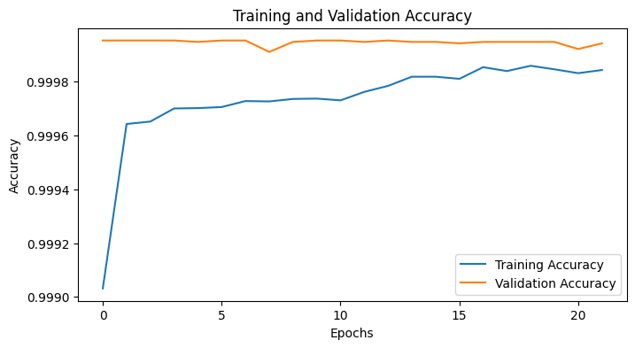

 - **Confusion matrix**:

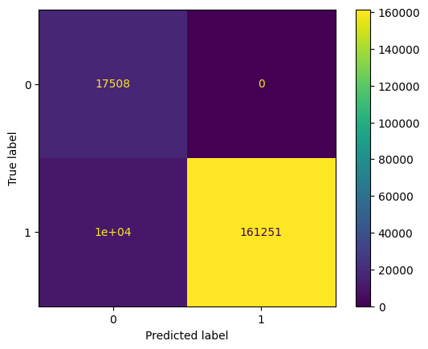

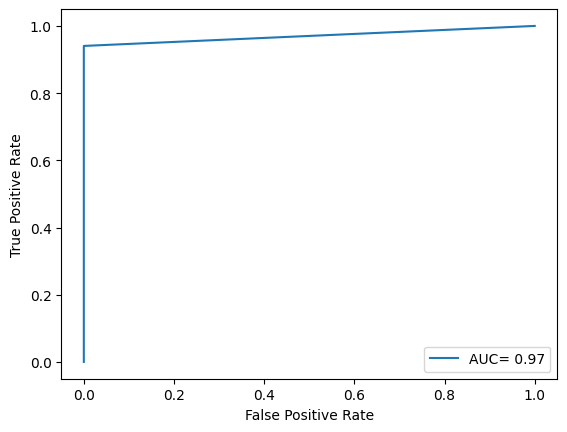

 - Strengths:
  - The model has high accuracy (94.6%).
  - Perfect precision and specificity, meaning there are no false positives.
  - High recall (94.1%) and a strong F1 score (97%).

 - Weaknesses:
  - The model still misses some positive instances (10,208 false negatives), which may be critical depending on the context of the application.
  - The imbalance in predictions (zero false positives but some false negatives) could indicate a bias towards negative predictions.

### Embeddings layer
#### Weights initializer
#### Kernel initializer
### Activation functions
### Optimizer

## Results
| Model                        |Accuracy|Precision avg|Recall avg|ROC score |
| :-------:                    | :----: | :---------: | :------: | :------: |
|Dense model                   |  0.09  |     0.05    |   0.50   |   0.50   |
|Dense model + embeddings      |  0.91  |     0.75    |   0.95   |   0.95   |
|Dense Model-shapelet Discovery|  0.85  |     0.42    |   0.50   |   0.50   |
|CNN model                     |  0.11  |     0.53    |   0.51   |   0.51   |
|CNN model + embeddings        |  0.95  |     0.82    |   0.97   |   0.97   |
|RNN model                     |  0.09  |     0.05    |   0.50   |   0.50   |
|RNN model + embeddings.       |  0.95  |     0.82    |   0.97   |   0.97   |
|LSTM model-shapelet Discovery |  0.85  |     0.42    |   0.50   |   0.50   |
|Transformer                   |  0.95  |     0.82    |   0.97   |   0.97   |

## Application of the Matrix Profile

With the concept of matrix profile, we tried to find conserved behaviours in the data. In fact, a comparison between sequences can be done by looking at the euclidean distance between all the points in two subsequences and represent the distances in a matrix profile.

## References
1. BETH Dataset: Real Cybersecurity Data for Anomaly Detection Research
Kate Highnam, Kai Arulkumaran, Zachary Hanif, Nicholas R. Jennings 
[https://www.gatsby.ucl.ac.uk/~balaji/udl2021/accepted-papers/UDL2021-paper-033.pdf](https://www.gatsby.ucl.ac.uk/~balaji/udl2021/accepted-papers/UDL2021-paper-033.pdf)
2. Smote: Synthetic Minority Over-sampling Technique
Authors: Nitesh V. Chawla, Kevin W. Bowyer, Lawrence O. Hall, W. Philip Kegelmeyer
[https://arxiv.org/pdf/1106.1813](https://arxiv.org/pdf/1106.1813)
3. Time Series Shapelets: A New Primitive for Data Mining
Lexiang Ye, Eamonn Keogh
[https://www.cs.ucr.edu/~eamonn/shaplet.pdf)
