# Beth-project

## Introduction 
The BETH dataset addresses a critical need in cybersecurity research: the availability of real-world, labeled data for anomaly detection. Unlike synthetic datasets, BETH captures genuine host activity and attacks, making it a valuable resource for developing robust machine learning models. 

 The scale, diversity, and structured heterogeneity of BETH dataset makes it an invaluable resource for advancing anomaly detection techniques and enhancing the robustness of machine learning models in the cybersecurity domain.

**Size and Composition of the dataset:**
- BETH comprises over eight million data points collected from 23 hosts.
- Each host records both benign activity (normal behavior) and, at most, one attack.
- The dataset is diverse, reflecting various types of network traffic and system events.
  
**Structured Heterogeneity of the dataset:**
- BETH’s features are highly structured but heterogeneous.
- This diversity mirrors the complexity of real-world cybersecurity data.
- Features include network traffic statistics, system logs, and process-level information.
  
**Scale and realism of the BETH dataset:**
- BETH is one of the largest publicly available cybersecurity datasets.
- It captures contemporary host behavior, including modern attacks.
- Researchers can use BETH to study the impact of scale on anomaly detection algorithms.

**Behavioral Diversity:**
- The dataset covers a wide range of activities, from routine tasks to malicious actions.
- Hosts exhibit different patterns, making BETH suitable for behavioral analysis.

**Robustness Benchmarking:**
- BETH enables evaluating the robustness of machine learning models.
- Researchers can assess how well their algorithms generalize to unseen attacks.
- It serves as a benchmark for novel anomaly detection techniques.

## Data analysis
The Beth datset represents more than 8 milions events collected over 23 honeypots, only nearly 1 milion of it will be used on this project.
Data are already divided into training, valadating and testing dataset (60% / 20% /20%).

### Features
Each of this dataset has those features:
 - timestamp: time in seconds since system  boot (float)
 - processId: id of the process spawning this log (integer)
 
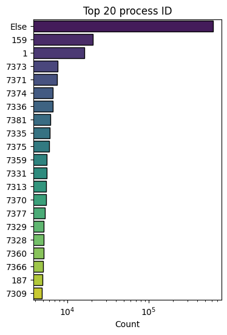

 - threadId: id of the thread (integer)
 
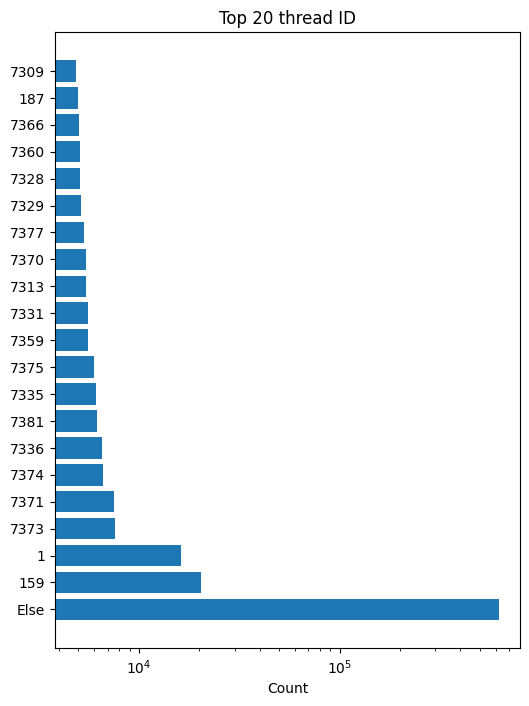

 - parentProcessId: paren process id (integer)
 
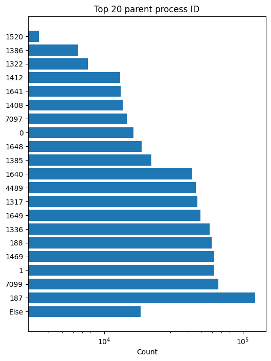

 - userId: login integer id (integer)
 
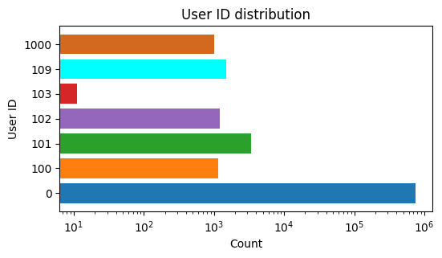

 - mountNamespace: Set mounting restrictions this process log (integer)
 

 - processName: command executed (string)
 - hostName: host server (string)
 
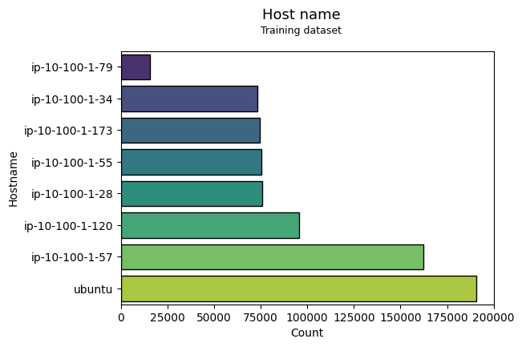

 - eventId: id of the event generating this log (integer)
 - eventName: name of the event (string)
 
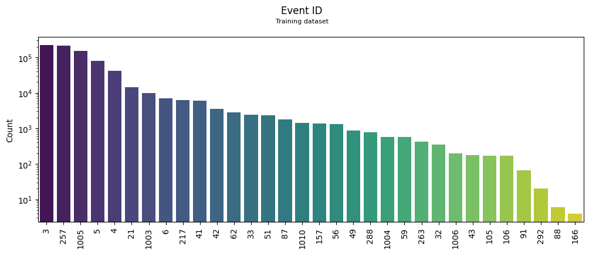

 
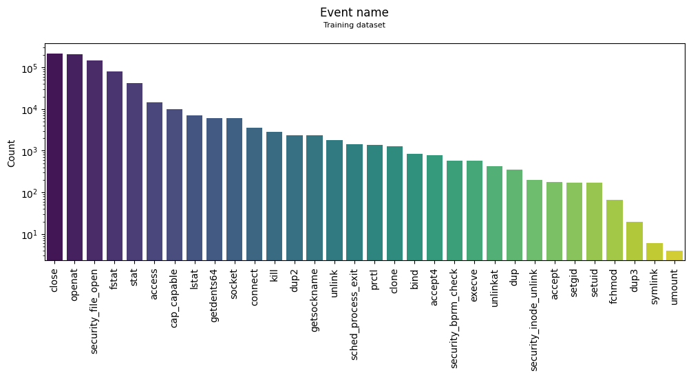

 - stackAddresses: memory values relevant to the process (list of integer)
 - argsNum: number of arguments (integer)
 - returnValue: value returned from this event log (integer)
 - args: arguments passed to this process (list of dictionaries)
 - sus: label (0/1) for suspicious activity (integer)
  - Training
  
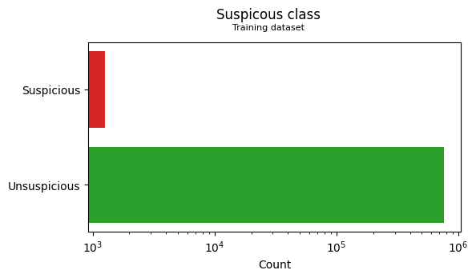

  - Validation
  
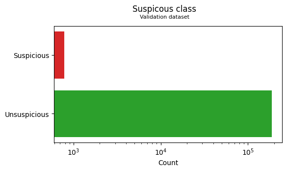

  - Testing
  
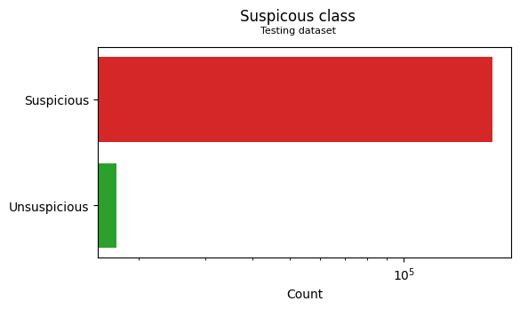

 - evil: label (0/1) for evil activity (integer)
  - Training
  - Validation
  - Testing
## Data preparation
### Numerical data transformation
As adviced by the authors of the beth dataset's paper, we applied these transformation:
 - ProcessId and ParentprocessId: 0 if it is [0,1,2] otherwise 1
 - UserId: 0 if id is less than 1000 otherwise 1
 - MountNameSpace: 0 if it is equal to 4026531840 otherwise 1
 - ReturnValue: 0 if it is 0, 1 if it is positif and 2 if it is negatif

### StackAddresses
Stackaddresses if a list of numerics.
### Args
Args column contains dictionaries.
### Ordinal encoding
Ordinal encoding is a technique for converting categorical data, where variables have distinct labels or categories, into numerical form suitable for machine learning algorithms. It assigns a unique integer value to each category based on its order or rank.
As our approch is for an unsupervised model, we used ordinal encoder to handle new classes not present in the training dataset.
### Scaling
Numerical features are scaled to similar range as they have different scales.
Since we used ordinal encoding for categorical features, scaling is not necessary. Ordinal encoding preserves the order of the categories, but the assigned values don't necessarily reflect their magnitude.
### Smote:
Dealing with unbalanced data can be tricky, most of the machine learning model will give good results for big classes and poor performance on the minority althought, as it is our case, minority class is more important.
To balance that, we tried to use Smote library combined as it is adviced with randoom undersampling for the majority class.
SMOTE (Synthetic Minority Oversampling TEchnique) works by interpolating new instances along line segments joining existing minority class instances.

## Results
| Model                  |Accuracy|Precision avg|Recall avg|ROC score |
| :-------:              | :----: | :---------: | :------: | :------: |
|Dense model             |  0.09  |     0.05    |   0.50   |   0.50   |
|Dense model + embeddings|  0.91  |     0.75    |   0.95   |   0.95   |
|CNN model               |  0.11  |     0.53    |   0.51   |   0.51   |
|CNN model + embeddings  |  0.95  |     0.82    |   0.97   |   0.97   |
|RNN model               |  0.09  |     0.05    |   0.50   |   0.50   |
|RNN model + embeddings. |  0.95  |     0.82    |   0.97   |   0.97   |
|Transformer             |  0.95  |     0.82    |   0.97   |   0.97   |

## Application of the Matrix Profile

With the concept of matrix profile, we tried to find conserved behaviours in the data. In fact, a comparison between sequences can be done by looking at the euclidean distance between all the points in two subsequences and represent the distances in a matrix profile.

### Event Frequency 

The following chart shows the all enrite frequency of suspicius and not suspicius event

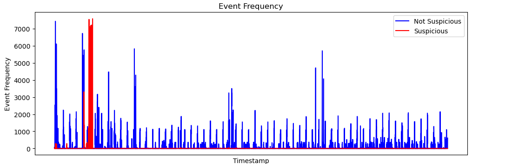

### Shapelet Discovery 

Shapelet discovery is a technique used in time series analysis to identify discriminative subpatterns, known as shapelets, within a set of time series data. Shapelets are subsequences that capture characteristic patterns or behaviors in the data.
The process of shapelet discovery involves searching through the time series data to find subsequences that are representative of different classes or categories like in our case for **suspicious activities and not suspicious activities**. 
The similarity or distance between each subsequence and the rest of the data is computed to determine its discriminative power. The shapelets with the highest discriminative power are selected as representative patterns.

So the shapelet discovery can use the matrix profile as a tool for efficiently computing the distances or similarities between subsequences. By utilizing the matrix profile, shapelet discovery algorithms can reduce the computational complexity and speed up the process of identifying shapelets.

