# Beth-project

## Introduction 
The BETH dataset addresses a critical need in cybersecurity research: the availability of real-world, labeled data for anomaly detection. Unlike synthetic datasets, BETH captures genuine host activity and attacks, making it a valuable resource for developing robust machine learning models [1].

 The scale, diversity, and structured heterogeneity of BETH dataset makes it an invaluable resource for advancing anomaly detection techniques and enhancing the robustness of machine learning models in the cybersecurity domain.

**Size and Composition of the dataset:**
- BETH comprises over eight million data points collected from 23 hosts.
- Each host records both benign activity (normal behavior) and, at most, one attack.
- The dataset is diverse, reflecting various types of network traffic and system events.
  
**Structured Heterogeneity of the dataset:**
- BETH’s features are highly structured but heterogeneous.
- This diversity mirrors the complexity of real-world cybersecurity data.
- Features include network traffic statistics, system logs, and process-level information.
  
**Scale and realism of the BETH dataset:**
- BETH is one of the largest publicly available cybersecurity datasets.
- It captures contemporary host behavior, including modern attacks.
- Researchers can use BETH to study the impact of scale on anomaly detection algorithms.

**Behavioral Diversity:**
- The dataset covers a wide range of activities, from routine tasks to malicious actions.
- Hosts exhibit different patterns, making BETH suitable for behavioral analysis.

**Robustness Benchmarking:**
- BETH enables evaluating the robustness of machine learning models.
- Researchers can assess how well their algorithms generalize to unseen attacks.
- It serves as a benchmark for novel anomaly detection techniques.

## Data analysis
The Beth datset represents more than 8 milions events collected over 23 honeypots, only nearly 1 milion of it will be used on this project.
Data are already divided into training, valadating and testing dataset (60% / 20% /20%).

### Features
Each of this dataset (training, valadating and testing dataset) has features showed in the below table:

 - timestamp: time in seconds since system  boot (float)

 - processId: id of the process spawning this log (integer) - The bar chart shows the top 20 process IDs (PIDs) based on their count. The process labeled “Else” has the highest count, far exceeding the counts of any individual Process ID. PID 159 has the second-highest count, noticeably higher than the rest of the process IDs, though much lower than “Else”. Each colored bar represents a distinct process ID, with colors transitioning from dark purple for higher counts to lighter green for lower counts.
   
 

 - threadId: id of the thread (integer)
 there is a total of 545 thread ids.
 

 - parentProcessId: parent process id (integer)
 

 - userId: login integer id (integer) - Parent process ID “187” has the highest count, nearing 100,000 occurrences. Other IDs such as “7099”, “1”, “1469”, “188”, and “1336” show decreasing counts. The counts are plotted on a logarithmic scale. The colors range from dark purple for the least occurrences to light green for the most occurrences.
   
 

 - mountNamespace: Set mounting restrictions this process log (integer)
 

 - processName: command executed (string)
 
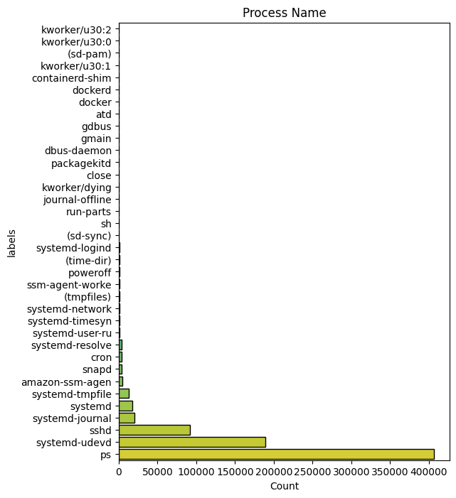

 - hostName: host server (string) - The hostname “ubuntu” has the highest count, nearly reaching 200,000 occurrences. Other hostnames such as “ip-10-100-1-57”, “ip-10-100-1-120”, “ip-10-100-1-28”, “ip-10-100-1-55”, and “ip-10-100-1-173” show a descending count, with the least count observed for “ip-10-100-1-79”. The colors range from dark purple for the least occurrences to light green for the most occurrences.
   
 

 - eventId: id of the event generating this log (integer)

 - eventName: name of the event (string)
 

 

 - stackAddresses: memory values relevant to the process (list of integer)
 

 

 - returnValue: value returned from this event log (integer)
 

 - argsNum: number of arguments (integer)
 

 - args: arguments passed to this process (list of dictionaries)

 - sus: This is an integer label where 0 indicates non-suspicious activity and 1 indicates suspicious activity.
 We want to develop a model that can accurately classify and identify suspicious activities based on this labeling system.
 

 - evil: This is an integer label where 0 indicates non-malicious activity and 1 indicates malicious activity.
 This label was not chosen for classification because the training and validation datasets do not contain any malicious classes.
 

### Correlation matrix

 - Strong Positive Correlations:
    - processId and threadId: They have a correlation of 1.00, indicating they are perfectly correlated. This makes sense as threadId is often associated with processId.
    - parentProcessId and userId: With a correlation of 0.55, it suggests a moderate positive relationship. Likely because parent processes are tied to user accounts.
    - sus and userId: This has a high correlation of 0.77, suggesting that suspicious activity (sus) is strongly linked with specific user IDs.
    - evil and userId: This shows a very strong positive correlation of 0.90, indicating that 'evil' actions are highly associated with certain user IDs.
    - sus and evil: With a correlation of 0.73, it indicates that actions labeled as suspicious are strongly correlated with those labeled as evil.

 - Moderate Positive Correlations:
    - timestamp and userId: A correlation of 0.68 suggests that timestamps are moderately positively related to user IDs, possibly indicating certain users are more active at certain times.
    - parentProcessId and timestamp: With 0.67, it shows a moderate positive relationship.
    - sus and parentProcessId: This correlation is 0.69, indicating that suspicious activities are moderately correlated with parent processes.
    - evil and parentProcessId: Correlation of 0.72, indicating a strong association between evil actions and parent processes.

 - Negative Correlations:
    - mountNamespace with processId, threadId, parentProcessId: These are moderately negatively correlated (around -0.26), indicating that certain process/thread IDs and their parent processes are less likely to have specific mountNamespace values.
    - eventId with timestamp, userId, sus, evil: Negative correlations, especially -0.36 with timestamp and -0.39 with userId, suggest that certain events are less likely to happen at certain times or for certain users.
    - eventId with sus and evil: Both are negatively correlated (around -0.35 to -0.38), indicating that particular events are less associated with suspicious and evil activities.

 - Low/No Correlation:
    - argsNum and other variables: Mostly low correlations, suggesting that the number of arguments has little to no linear relationship with the other features.
    - returnValue and other variables: Low correlations overall, indicating the return value of processes is largely independent of other features.

 - Interpreting Specific Pairs:
    - timestamp and sus/evil: These have correlations of 0.62 and 0.70, respectively. This suggests that the timing of events is significantly associated with suspicious and evil activities.
    - mountNamespace: Shows mostly weak correlations with other features, suggesting that mountNamespace values are relatively independent of other variables.

### Event Frequency 
The following chart shows the entire frequency of suspicius and not suspicius event:

 - Event Frequency: The y-axis represents the frequency of events, ranging from 0 to over 7000.

 - Timestamp: The x-axis represents the timestamps when the events occurred.

 - Not Suspicious Events: Represented by blue lines. The frequency of these events is higher and more variable, with several spikes reaching high values, particularly towards the left side of the chart.

 - Suspicious Events: Represented by red lines. These events are less frequent and usually have lower values compared to the "Not Suspicious" events. There are a few noticeable spikes in the red lines, indicating higher frequencies of suspicious events at certain timestamps.

Overall, the chart shows that "Not Suspicious" events occur more frequently and with higher peaks compared to "Suspicious" events, which occur less often and with lower peaks.

## Data preparation
### Numerical data transformation
As adviced by the authors of the beth dataset's paper, we applied these transformation:
 - ProcessId and ParentprocessId: 0 if it is [0,1,2] otherwise 1
 - UserId: 0 if id is less than 1000 otherwise 1
 - MountNameSpace: 0 if it is equal to 4026531840 otherwise 1
 - ReturnValue: 0 if it is 0, 1 if it is positif and 2 if it is negatif

### StackAddresses
Stackaddresses sf a list of numerics with a maximum of 20 elements.
We created 20 new columns named "stack_1", "stack_2", etc. in each dataset, and assigns each element from the list to its respective new column.

### Args
Args column contains a list of maximum 5 dictionaries, each disctionary contains three elements ({'name': 'dev', 'type': 'dev_t', 'value': 211812353}).
We created 15 new columns in each datset, and assigns each element from the dictionaries to its respective new column.

### Ordinal encoding
Ordinal encoding is a technique for converting categorical data, where variables have distinct labels or categories, into numerical form suitable for machine learning algorithms. It assigns a unique integer value to each category based on its order or rank.
As our approch is for an unsupervised model, we used ordinal encoder to handle new classes not present in the training dataset.\
Ordinal encoder will assign -1 value to unknown classes (labels not present in the training dataset)

### Scaling
Numerical features are scaled to similar range as they have different scales.
Since we used ordinal encoding for categorical features, scaling is not necessary. Ordinal encoding preserves the order of the categories, but the assigned values don't necessarily reflect their magnitude.
### Smote
Dealing with unbalanced data can be tricky, most of the machine learning model will give good results for big classes and poor performance on the minority althought, as it is our case, minority class is more important.
To balance that, we tried to use Smote library combined as it is adviced with randoom undersampling for the majority class.
SMOTE (Synthetic Minority Oversampling TEchnique) works by interpolating new instances along line segments joining existing minority class instances.

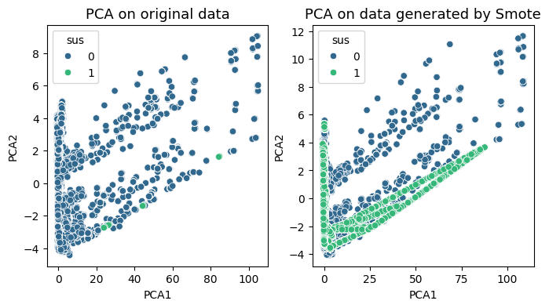

### Shapelet discovery method
Shapelet discovery is a technique used in time series analysis to identify discriminative subpatterns, known as shapelets, within a set of time series data. Shapelets are subsequences that capture characteristic patterns or behaviors in the data.
The process of shapelet discovery involves searching through the time series data to find subsequences that are representative of different classes or categories like in our case for **suspicious activities and not suspicious activities**. 
The similarity or distance between each subsequence and the rest of the data is computed to determine its discriminative power. The shapelets with the highest discriminative power are selected as representative patterns.

So the shapelet discovery can use the matrix profile as a tool for efficiently computing the distances or similarities between subsequences. By utilizing the matrix profile, shapelet discovery algorithms can reduce the computational complexity and speed up the process of identifying shapelets.

With the concept of matrix profile, we tried to find conserved behaviours in the data. In fact, a comparison between sequences can be done by looking at the euclidean distance between all the points in two subsequences and represent the distances in a matrix profile.

For the high computational requiremnts, in order to experiment the **Shapelet Discovery**, we decided to adopt a sample of 230.000 datapoints and see how this method performs for the Decison tree classifier, LSTM and the Dense model.

## Models
### Dense neural network

#### Model 1:

   - **Description**
      This model is composed with five hidden dense layers each with 512 units and ReLU activation, interspersed with dropout layers for regularization, and an output layer   
      with a single unit and sigmoid activation for binary classification. Each dense layer uses the 'lecun_normal' initializer for the kernel and a RandomNormal initializer 
      for the bias.
      
      

   - **Training**
      

         
         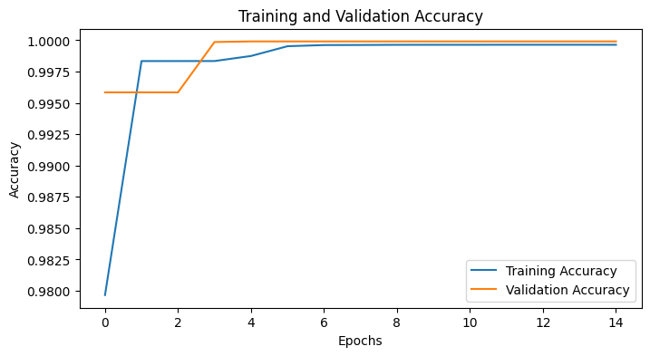 
      

   - **Prediction**\
      **Model 1** seems to predict only the "unsuspicious" class and fails to detect any "suspicious" activities, resulting in poor performance for identifying suspicious activities.
      
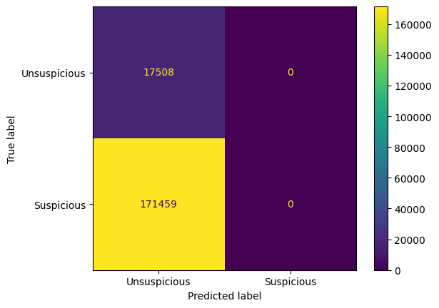

#### Model 2:
   - **Description**
      This model is a neural network that handle differently categorical and numerical features. It incorporates embeddings for the categorical inputs, which are then reshaped and concatenated with numerical inputs, followed by multiple dense layers with ReLU activations and dropout for regularization.
      The final output layer uses a sigmoid activation function to produce a binary classification result.

      

   - **Training**
      

         
         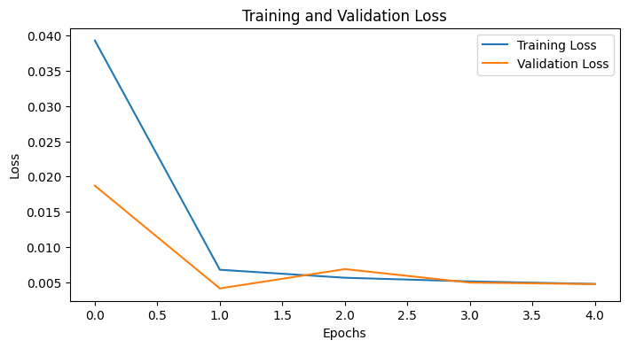 
      

   - **Prediction**\
      **Model 2** shows a strong ability to correctly identify suspicious activities while maintaining a low false positive rate.
      However, there is still room for improvement in reducing the number of false negatives, which could enhance the model's sensitivity to suspicious activities.
      We have also very low false positive rate for unsuspicious class.

      
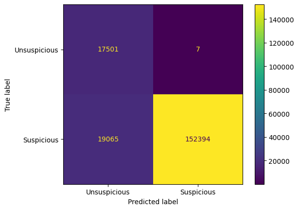

#### Model 3:
   - **Description**
      This model is similar to **Model 1**, this model is trained on data after appluying Smote data augmentation technic.
      

   - **Training**

      

         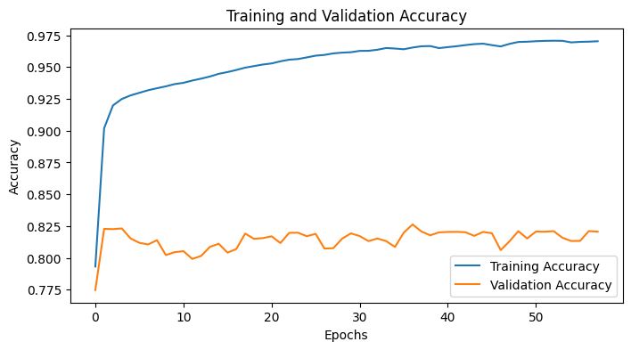
          
      

   - **Prediction**\
      After applying SMOTE, the model exclusively predicts the "unsuspicious" class and fails to identify any "suspicious" activities. This indicates that the model is not effectively learning from the augmented data, even with the improved balance in our dataset.

      

#### Model 4- Dense model with the Shapelet Discovery method :
   - **Description**\
     The model starts with an input layer that receives inputs of shape (1). It then passes through a series of dense layers, each followed by dropout layers for 
     regularization. The output of the model is a single value.
     
      

   - **Training**
     
      

   - **Confusion Matrix**\
     The confusion matrix shows that we have few false negatives (913) and few false positives (12). 
     
      

### Convolutional neural network
#### Model 1
   - **Description**\
      This model is a Convolutional Neural Network (CNN) with an input shape of (47, 1).\
      It comprises four Conv1D layers with decreasing filter sizes (256, 128, 64, and 32) and ReLU activations, each followed by a dropout layer to prevent overfitting. We applied a Lecun normal initializer for the kernels and a custom random normal initializer for the biases.\
      The output layer is a dense layer with a sigmoid activation function for binary classification.

      

   - **Training**

      

         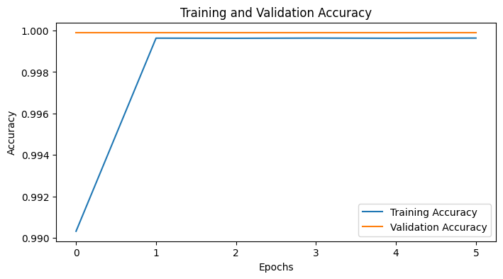
          
      

   - **Prediction**
      
      
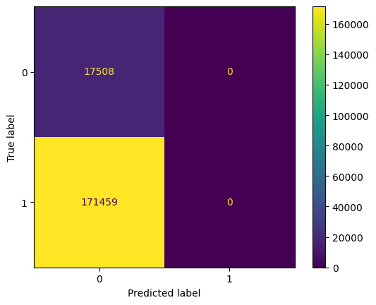
 

#### Model 2
   - **Description**\
      This model handles categorical and numerical inputs separately, using embeddings and dense layers for preprocessing.\
      It creates embeddings for two categorical features (args and stackaddresses), followed by linear transformations, and processes numerical features through a dense layer and reshaping.\
      The processed embeddings and numerical features are concatenated and passed through two Conv1D layers with ReLU activations for feature extraction.\
      Finally, the output layer is a dense layer with a sigmoid activation function for binary classification.
      

   - **Training**

      

         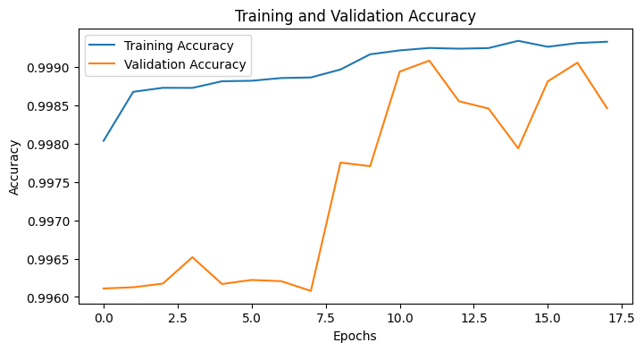
          
      

   - **Prediction**
      
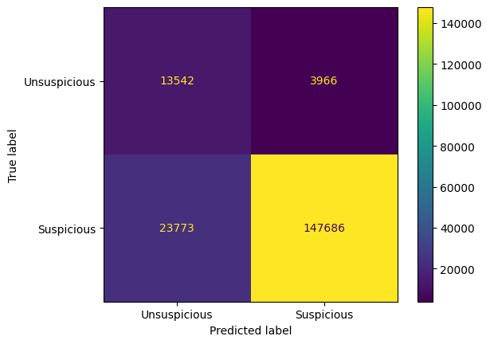
 

### LSTM neural network
#### Model 1 (no embeddings)
   - **Description**\
      This model is a Sequential Long Short-Term Memory (LSTM) network designed for sequence data with an input shape of (47, 1).
      It consists of four LSTM layers, each with 32 units and ReLU activations, using Lecun normal initialization for the kernels and a custom random normal initializer for the biases, followed by dropout layers to prevent overfitting.
       The output from the LSTM layers is flattened and passed through a dense layer with 128 units and a final dense layer with a sigmoid activation function for binary classification.
      
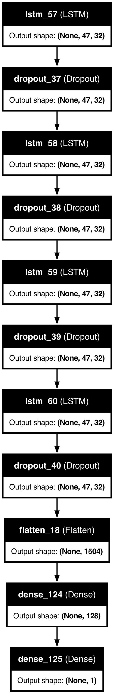

   - **Training**
      

         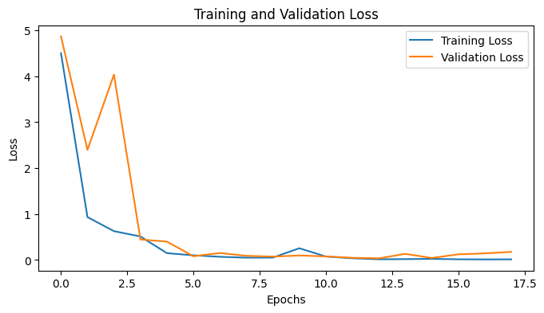
         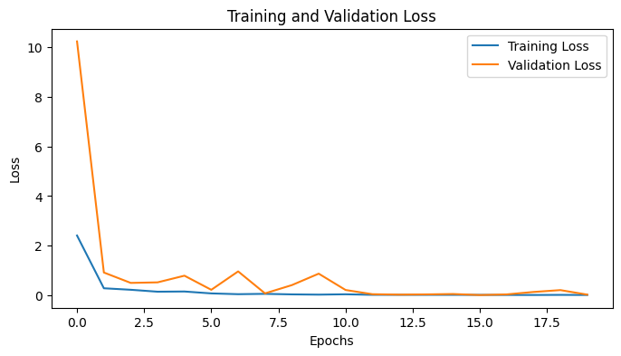 
      

   
   - **Prediction**
      
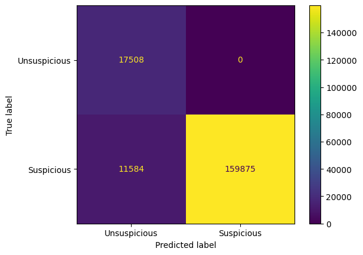

      The confusion matrix indicates that the model is highly effective in identifying suspicious activities, correctly classifying 159,875 out of 171,459 suspicious instances while maintaining a perfect true negative rate with 17,508 correct unsuspicious classifications.
      However, it still misses 11,584 suspicious instances

#### Model 2
   - **Description**
      
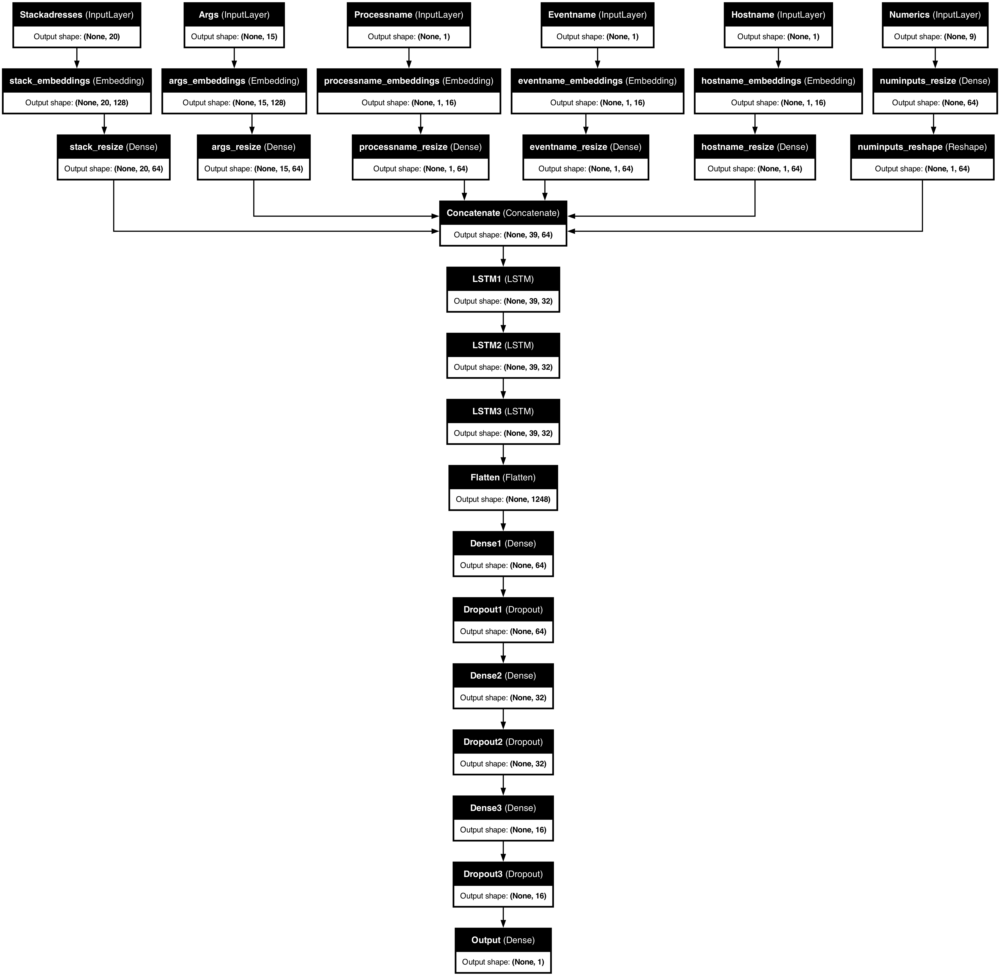

   - **Training**
      

         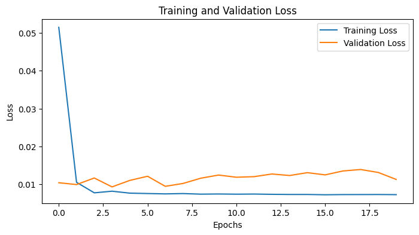
         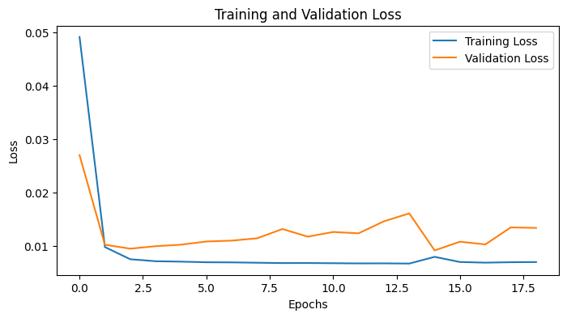 
      

   - **Prediction**
      

#### Model 3 (shapelet discovery method)
   - **Description**\
     This model is a Sequential Long Short-Term Memory (LSTM) network designed for sequence data with an input shape of (1, 1).It consists of four LSTM  layers, each with 32  
     units and ReLU activations, using Lecun normal initialization for the kernels and a custom random normal initializer for the biases, followed by dropout layers to prevent 
     overfitting.The output from the LSTM layers is flattened and passed through a dense layer with 128 units and a final dense layer with a sigmoid activation function for 
     binary classification.

     

   - **Training**\
     As the graphes show, the LSTM doesn't give good resulst when you apply the shapeet discovery method. The performace of the model is really poor and ineffective.

      
 
   - **Prediction**

     

### Decision Tree Classifier with Shapelet Discovery method
       
   - **Prediction**\
     The confusuion matrix shows a small number of False Positives (25), which is good as it shows the model rarely predicts class 1 when the true class is 0.
     A relatively low number of False Negatives (1989), indicating the model occasionally misses class 1 predictions. Overall the model seems to learn. 
     
     

### Transformer

   - **Description**\
      This model integrates categorical and numerical inputs using a transformer-based architecture.\
      Categorical inputs are embedded and transformed via dense layers, while numerical inputs are processed through a dense layer and reshaped.\
      The combined embeddings and numerical features are enhanced with positional encoding and passed through several transformer encoder blocks, followed by convolutional layers, global average pooling, and fully connected layers, ultimately producing a single sigmoid-activated output.

      
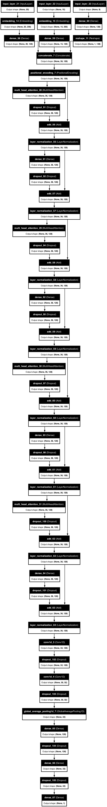

      - Positional encoding adds information about the position of each element in the sequence by creating a positional encoding matrix, which applies sinusoidal functions to encode positional information.\
       This matrix is added to the input embeddings, allowing the model to incorporate the order of the sequence elements, which is crucial for the transformer to understand the sequential nature of the data.

       - The transformer_encoder_block applies multi-head self-attention to the inputs, enabling the model to focus on different parts of the sequence simultaneously.\
       This is followed by a dropout layer for regularization and layer normalization to stabilize and speed up training.\
       Finally, a feed-forward neural network with a dense layer, dropout, and another layer normalization is used to further process the attention output, enhancing the model's capacity to capture complex patterns in the data.

       - This model uses Adam optimizer with a **WarmUpCosineDecay** learning rate.\
       During the warmup phase, the learning rate increases linearly, and once the warmup steps are completed, it follows a cosine decay pattern to gradually reduce the learning rate.

       
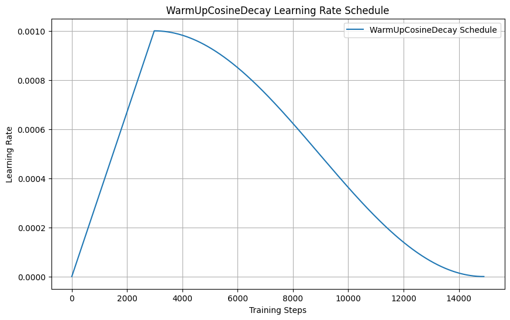

   - **Training**:
      

         
          
      

   - **Prediction**:
      

      - Strengths:
         - The model has high accuracy (94.6%).
         - Perfect precision and specificity, meaning there are no false positives.
         - High recall (94.1%) and a strong F1 score (97%).

      - Weaknesses:
         - The model still misses some positive instances (10,208 false negatives), which may be critical depending on the context of the application.
         - The imbalance in predictions (zero false positives but some false negatives) could indicate a bias towards negative predictions.
  

## Results
| Model                        |Accuracy|Precision avg|Recall avg|ROC score |
| :-------:                    | :----: | :---------: | :------: | :------: |
|Dense model                   |  0.09  |     0.05    |   0.50   |   0.50   |
|Dense model + embeddings      |  0.91  |     0.75    |   0.95   |   0.95   |
|CNN model                     |  0.11  |     0.53    |   0.51   |   0.51   |
|CNN model + embeddings        |  0.95  |     0.82    |   0.97   |   0.97   |
|RNN model                     |  0.09  |     0.05    |   0.50   |   0.50   |
|RNN model + embeddings.       |  0.95  |     0.82    |   0.97   |   0.97   |
|Transformer                   |  0.95  |     0.82    |   0.97   |   0.97   |

**Shapelet Discovery method with 230.000 data points**
| Model                        |Accuracy|Precision avg|Recall avg|ROC score |
| :-------:                    | :----: | :---------: | :------: | :------: |
|Decision tree classifier      |  0.97  |     0.98    |    0.97  |     0.97 |
|LSTM model                    |  0.45  |     0.35    |    0.41  |     0.41 |
|Dense Model                   |  0.96  |     0.97    |  0.95    |     0.95 |

## Discussion
The results of our experiments on the BETH dataset reveal a range of insights into the effectiveness of various machine learning models for anomaly detection in the field of cybersecurity. This discussion aims to analyze the performance of the models, identify challenges in data processing and model development, and discuss potential improvement strategies.

**Model Effectiveness**

Most models demonstrated high validation accuracy and converged quickly, indicating a high similarity between the training and validation datasets. This could also suggest that the task is relatively simple, which may not fully reflect real-world challenges. Particularly notable are the CNN and RNN models, which showed a significant performance boost through the use of embeddings. The transformer approach also exhibited high accuracy and F1 scores, underscoring its suitability for complex data patterns.

**Data Processing Challenges**

A major challenge was handling the highly imbalanced dataset. The BETH dataset is characterized by a dominance of non-suspicious events, which affected model performance. Despite using the SMOTE technique to generate synthetic data for the minority class, some models struggled to correctly classify suspicious behavior. This highlights the need for advanced data balancing techniques and the integration of additional features to improve classification.

**Form of Data Preparation**

Our experiments with the Shapelet Discovery method showed that while it is theoretically promising, it did not deliver the expected results in practice due to the structure of the BETH dataset and the high computational power required. The method performed well on smaller samples but was not scalable to the entire dataset. Future work could focus on developing more efficient algorithms for shapelet discovery or exploring alternative feature extraction methods.

**Model-Specific Results**

   1. Dense Neural Networks (DNNs): The DNN models showed varying results, with some models performing well and others not. The use of embeddings in DNNs (Model 2) significantly improved performance compared to models without embeddings. However, Model 3, after applying SMOTE, showed insufficient performance, indicating a lack of learning ability from the augmented data.

   2. Convolutional Neural Networks (CNNs): CNNs, particularly Models 5 and 6, achieved high accuracies and low error rates. This suggests that CNNs are well-suited to recognize structural features in the data, especially when using embeddings.

   3. Recurrent Neural Networks (RNNs): The LSTM models (Models 7 to 9) showed mixed results. While Model 7 exhibited a high capability for detecting suspicious activities, Model 9, which used the Shapelet Discovery method, was ineffective.

   4. Transformer: The transformer showed the best overall performance, particularly through the use of positional encoding and multi-layer self-attention, enhancing its ability to detect complex patterns in the data.

   5. Decision Tree Classifier with Shapelet Discovery: Although this approach had a low number of misclassifications, it was overall less effective than the neural networks.

**Improvement Suggestions**

For future work, we suggest the following approaches:

   1. Advanced Data Augmentation: In addition to SMOTE, other techniques such as GANs (Generative Adversarial Networks) could be used to generate synthetic data.

   2. Feature Engineering: Developing and integrating additional relevant features could further improve model performance.

   3. Model Hybridization: Combining different model approaches could leverage the strengths of individual models and improve overall performance.

   4. Training Strategy Adjustment: Using advanced training strategies such as transfer learning and ensemble learning could enhance the models' generalization ability.

   5. More Efficient Algorithms: Developing more efficient algorithms for methods like Shapelet Discovery could improve the scalability and applicability of these approaches.

In summary, this work highlights the potentials and challenges of using machine learning on real cybersecurity data. Despite the high accuracy of most models, improving sensitivity to suspicious behavior remains a central challenge that needs to be addressed through advanced techniques and approaches.

## References
1. BETH Dataset: Real Cybersecurity Data for Anomaly Detection Research
Kate Highnam, Kai Arulkumaran, Zachary Hanif, Nicholas R. Jennings 
[https://www.gatsby.ucl.ac.uk/~balaji/udl2021/accepted-papers/UDL2021-paper-033.pdf](https://www.gatsby.ucl.ac.uk/~balaji/udl2021/accepted-papers/UDL2021-paper-033.pdf)
2. Smote: Synthetic Minority Over-sampling Technique
Authors: Nitesh V. Chawla, Kevin W. Bowyer, Lawrence O. Hall, W. Philip Kegelmeyer
[https://arxiv.org/pdf/1106.1813](https://arxiv.org/pdf/1106.1813)
3. Time Series Shapelets: A New Primitive for Data Mining. Lexiang Ye, Eamonn Keogh
(https://www.cs.ucr.edu/~eamonn/shaplet.pdf)
